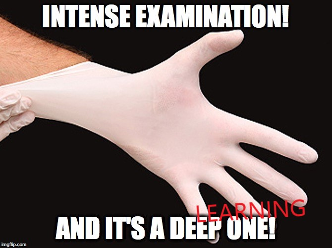

## Real-time Hand-Detection using Neural Networks (SSD) on Tensorflow + Gloves detection




Este repositorio tiene como misión detectar si las manos de un usuario que se ponen delante de la webcam tienen guantes o no. 
Para ello se hace uso de un repositorio cuyo enlace se puede ver a continuación y de un modelo de entrenador en **Teachable Machine** (disponible en la carpeta `gloves-checkpoint`).

Para entrenar el modelo decisión machine se han tomado aproximadamente unas 1000 fotografías de manos con guantes (`gloves-on`) y otras 1000 fotografías de manos sin guantes (`gloves-off`) en diversas posiciones. Para poder servir de manera rápida este modelo lanzamos una predicción sobre cada imagen servirda por la webcam y lo mezclamos con el modelo de detección y seguimiento de manos.

Recomendamos realizar o crear un entorno virtual de acuerdo al fichero `environment.yml` incluido en el repositorio.

Para poder hacer uso texto prueba de concepto simplemente ejecutar el script.
```bash
$ python detect_single_threaded_gloves.py
```
Un ejemplo rápido de cómo funciona se facilita en el [siguiente vídeo](gloves-detector-PoC.mp4).

En la carpeta [Teachable Machine Gloves Detection](Teachable-Machine-Gloves-Detection) se incluye todo el material descargable de ese servicio.
